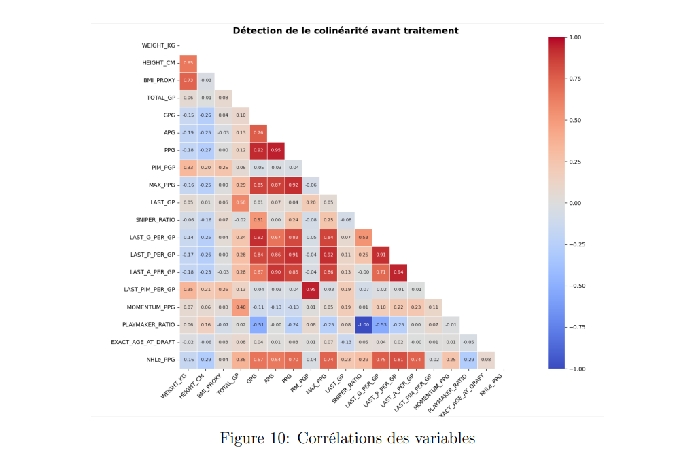
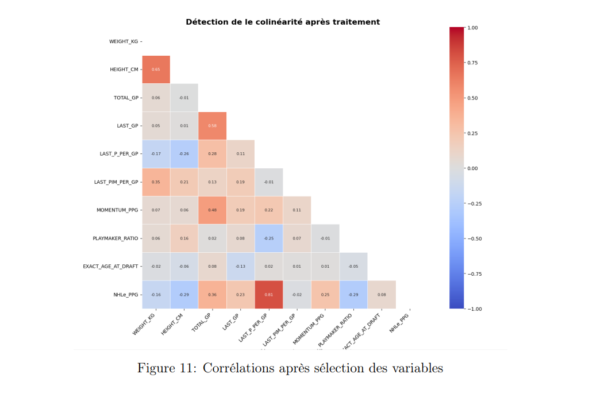
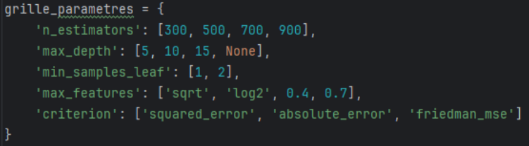
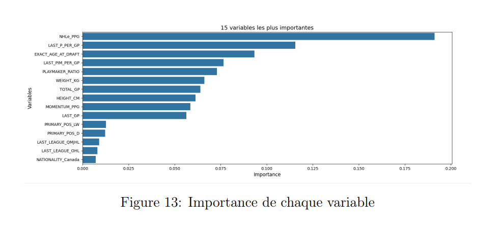
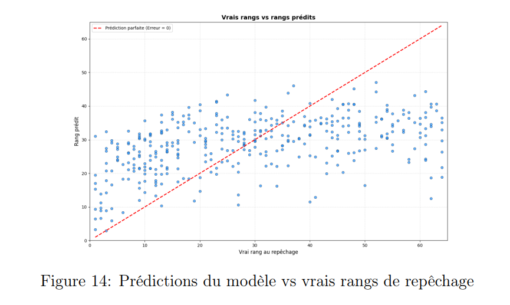

# Prédiction du rang de repêchage
*Méthodes d'analyse de données (STT-7335) — Hiver 2026*

[← Retour au portfolio](../../)

---

## Contexte

Projet d'équipe réalisé dans le cadre du cours STT-7335 (Université Laval), évaluant si le volume (quantité brute de statistiques) ou l'efficacité (production par match) des performances avant repêchage est le plus déterminant pour expliquer le rang de sélection d'un joueur dans la LNH (`DRAFT_OVERALL`).

**Ma contribution :** conception et implémentation du pipeline de préparation de données avancé pour l'apprentissage automatique (`process_data.py`) et développement complet de la modélisation par forêts aléatoires (`Foret_aleatoire.py`), incluant l'ingénierie de variables spécifiques, le traitement de la colinéarité, l'optimisation des hyperparamètres et l'analyse de performance. Le reste du rapport présente les travaux de l'équipe sur l'analyse descriptive, l'ACP et la régression linéaire.

## Construction et préparation du jeu de données

Le jeu de données global résulte de la fusion et de l'enrichissement de sources publiques Kaggle (*Elite Prospects* et *NHL Draft 1963–2022*) :
- **Fusion multi-sources :** Appariement par nom et année de naissance recalculée (`year - age`) pour récupérer les rangs de sélection manquants, suivi d'une jointure par `PLAYER_ID` avec l'historique saisonnier détaillé.
- **Nettoyage & Agrégation :** Élimination des doublons ambigus, imputation par médiane des valeurs manquantes d'efficacité, gestion des divisions par zéro et agrégation au niveau joueur (3 583 joueurs, 34 variables)[cite: 3].

## Ce que j'ai développé

### 1. Ingénierie des données pour le Machine Learning (`process_data.py`)
Génération d'un jeu de données enrichi spécifiquement pour la modélisation non linéaire[cite: 3] :
- **Facteurs d'équivalence de ligue (`NHLe_PPG`) :** Pondération de la production selon la difficulté relative des circuits (KHL à 0,80, SHL à 0,58, ligues juniors canadiennes de 0,26 à 0,32, etc.) d'après le modèle de P. Bacon[cite: 3].
- **Maturité et profils :** Calcul de l'âge exact continu au moment du repêchage (`EXACT_AGE_AT_DRAFT`), des ratios de profil offensif (`PLAYMAKER_RATIO`, `SNIPER_RATIO`) et de la dynamique d'amélioration (`MOMENTUM_PPG`)[cite: 3].
- **Filtrage ciblé :** Restriction aux choix des deux premières rondes (N = 1 232) pour éliminer le bruit aléatoire des rondes tardives, et sélection des joueurs ayant disputé au moins 5 matchs[cite: 3].

### 2. Modèle de forêt aléatoire (`Foret_aleatoire.py`)

#### Traitement de la colinéarité
Avant l'entraînement, une analyse matricielle a permis d'isoler les fortes colinéarités (notamment entre `PLAYMAKER_RATIO` et `SNIPER_RATIO` dont la somme vaut 1, ou encore les redondances entre buts, passes et points totaux)[cite: 3]. Le retrait des métriques redondantes au profit d'un indicateur synthétique clair (`LAST_P_PER_GP`) a permis de clarifier la structure du signal sans perte d'information[cite: 3].

*Figure 10 : Matrice de corrélation avant nettoyage, mettant en évidence d'importantes redondances structurelles entre les variables de scoring et d'indices corporels[cite: 3].*

*Figure 11 : Matrice de corrélation après sélection, assurant un jeu de variables décorrélées et informatives pour la forêt aléatoire[cite: 3].*

#### Optimisation par recherche sur grille
Afin d'obtenir la configuration optimale sans surapprentissage, une recherche par quadrillage (*Grid Search*) a été menée sur un split 70/30 (862 observations d'entraînement / 370 de test)[cite: 3], avec encodage one-hot des variables catégorielles (`LAST_LEAGUE`, `PRIMARY_POS`, `NATIONALITY`)[cite: 3].

*Figure 12 : Espace de recherche exploré pour calibrer le nombre d'estimateurs, la profondeur maximale et les critères de séparation des arbres[cite: 3].*

---

## Résultats clés (Random Forest)

- **Performance globale :** R² = 0,22 avec une erreur absolue moyenne (**MAE**) de **13,36 rangs** et un **RMSE** de **16,21** sur le jeu de test[cite: 3].
- **Précision par fenêtres de tolérance :** 13,51 % des sélections sont prédites à ±3 rangs, 42,43 % à ±10 rangs et 62,43 % à ±16 rangs[cite: 3].

### Importance des variables

*Figure 13 : Classement des variables selon leur contribution à la réduction de l'impureté dans la forêt aléatoire[cite: 3].*

L'analyse de l'importance des variables confirme sans ambiguïté les conclusions de l'étude :
1. **L'efficacité contextualisée domine :** `NHLe_PPG` est de loin la variable la plus importante, prouvant qu'un point en ligue professionnelle senior (KHL, SHL) a une valeur décisionnelle bien supérieure au volume accumulé en ligue junior[cite: 3].
2. **Le contexte immédiat et la maturité :** `LAST_P_PER_GP` (production récente) et `EXACT_AGE_AT_DRAFT` (âge précis au jour près) complètent le podium, démontrant que la maturité relative lors de l'année d'éligibilité influence fortement le jugement des recruteurs[cite: 3].

### Analyse des résidus et comportement prédictif

*Figure 14 : Distribution des prédictions du modèle par rapport à la diagonale idéale y = x[cite: 3].*

Le graphique révèle un comportement typique des modèles en environnement bruité :
- **Attraction vers la moyenne :** Pour minimiser son erreur quadratique globale, l'algorithme concentre ses prédictions dans une bande médiane (autour du 32ᵉ rang) et ne formule aucune prédiction au-delà du 48ᵉ rang[cite: 3].
- **Imprévisibilité des choix tardifs :** L'absence d'information sur les critères qualitatifs (vision de jeu, éthique de travail, entrevues de dépistage) rend les sélections de fin de 2ᵉ ronde difficiles à séparer statistiquement des profils moyens[cite: 3].

## Conclusion

La modélisation démontre que l'efficacité pondérée par la difficulté de la ligue et l'âge exact au repêchage sont nettement plus prédictifs que le volume de points cumulé[cite: 3]. Le plafonnement du pouvoir prédictif (R² = 0,22) met en lumière le caractère conservateur du modèle et les limites des données statistiques publiques, qui ne capturent pas les attributs intangibles décisifs pour les équipes de la LNH[cite: 3].

---

**Outils et bibliothèques :** Python · Scikit-Learn · Pandas · NumPy · Seaborn / Matplotlib

[Voir le rapport complet (PDF)](Rapport_LNH.pdf) &nbsp;|&nbsp; [Voir le code sur GitHub](https://github.com/BenoitDaigleCLG/Portfolio/tree/main/projets/prediction_LNH/code)
