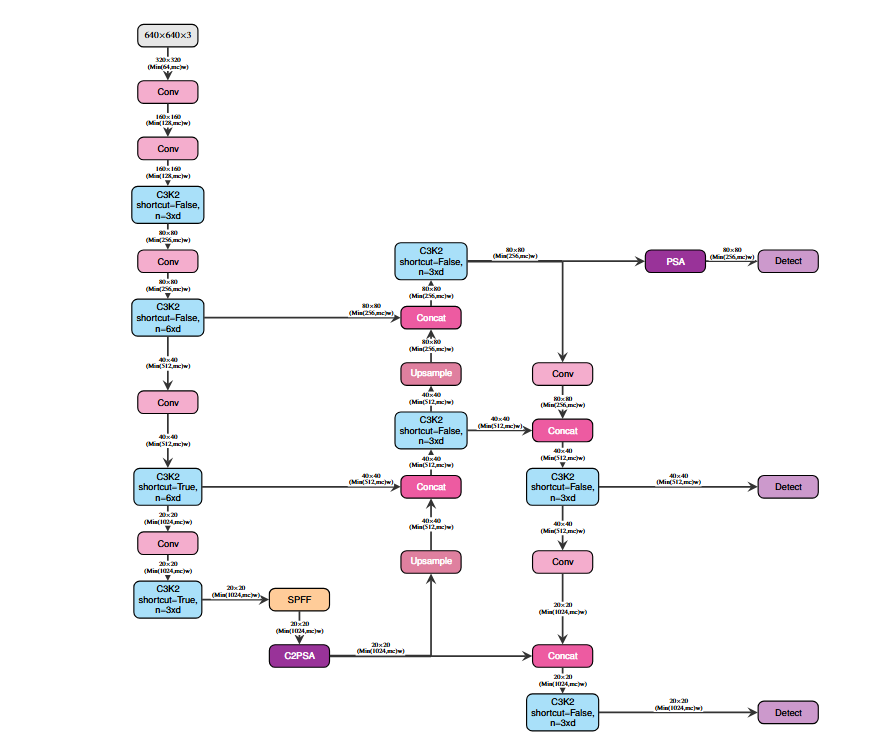
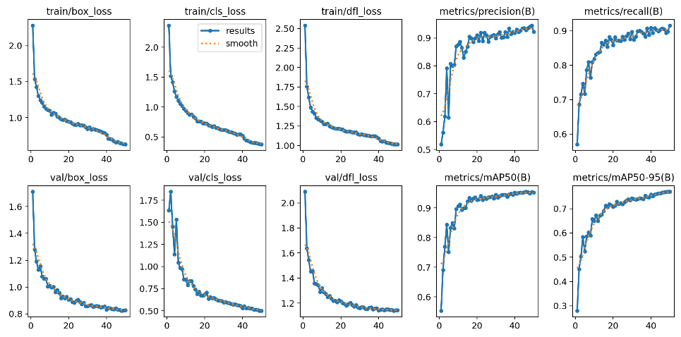
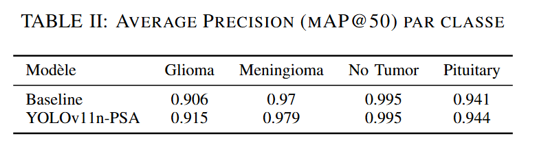
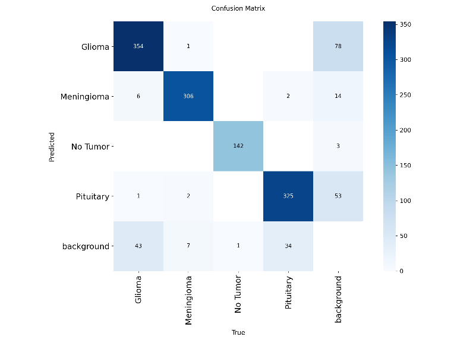

# Détection de tumeurs cérébrales
*Apprentissage par réseaux de neurones profonds (GLO-7030) — Hiver 2026*

[← Retour au portfolio](../../)

---

## Contexte

Projet réalisé en équipe de 5 dans le cadre du cours GLO-7030 (Université Laval), explorant différentes modifications architecturales de la famille YOLO pour la détection et la localisation de tumeurs cérébrales sur IRM (Gliome, Méningiome, Tumeur pituitaire, Sans tumeur).

**Ma contribution :** Implémentation d'une couche avec mécanisme d'attention **PSA (Position-Sensitive Attention)** dans l'architecture de base. Cela inclue le script d'entraînement et le pipeline de génération des résultats. Le reste du rapport présente les contributions de l'équipe sur les autres axes explorés (CBAM, architecture haute résolution HR-D).

## Ce que j'ai développé

### 1. Architecture custom (`architecture_custom.py`)
Génération dynamique d'un fichier de configuration YOLO11 modifié, intégrant une couche d'attention **PSA** insérée stratégiquement après la branche dédiée aux petits détails (contours fins), avant la tête de détection. L'entraînement s'est fait à résolution réduite (512×512) pour compenser la surcharge calculatoire du mécanisme d'attention.

*Figure 1 : Intégration du module PSA dans le neck de YOLOv11n, positionné juste après le bloc C3k2 sur la branche haute résolution pour capturer le contexte global sans perdre les contours fins.*

### 2. Script d'entraînement (`Main_2.py`)
Pipeline complet configurant automatiquement le dataset (chemins RoboFlow), chargeant les poids pré-entraînés YOLO11 comme point de départ, puis lançant l'entraînement avec les hyperparamètres du projet (AdamW, seed fixe à 42, early stopping, mosaic augmentation désactivé en fin d'entraînement).

*Figure 2 : Évolution des fonctions de perte (box, cls, dfl) et des métriques sur 50 époques. On note une convergence fluide et rapide dès la 20e époque, atteignant un mAP@50 stable supérieur à 95 % sans instabilité ni surapprentissage.*

### 3. Génération des résultats (`generer_resultats.py`)
Script d'évaluation calculant les métriques clés (Précision, Rappel, F1-Score, mAP@50) sur les jeux de validation et de test, globalement et par classe pathologique, exportées dans un rapport texte structuré avec Pandas.

---

## Résultats clés (PSA)

Le module PSA a amélioré toutes les métriques simultanément par rapport au modèle de base, avec la plus forte hausse observée sur la classe **Gliome** (+0,9 % de mAP@50), historiquement la plus difficile à délimiter en raison de ses contours diffus.

*Tableau II : Comparaison des performances de détection (mAP@50) par pathologie entre la Baseline et la variante YOLOv11n-PSA.*

### Analyse d'erreurs et matrice de confusion

*Figure 3 : Matrice de confusion sur le jeu de test.*

L'analyse de la matrice de confusion met en lumière la réalité clinique du modèle :
- **Excellence sur les tissus sains :** Un score quasi parfait sur la classe *No Tumor* (142 détections correctes sur 143).
- **Le défi persistant du Gliome :** Bien que le PSA apporte un gain net sur cette classe, elle concentre l'essentiel des faux négatifs (43 cas classés en arrière-plan/manqués) et des faux positifs (78 boîtes tracées sur l'arrière-plan). Ce comportement illustre le compromis complexe entre sensibilité de détection et délimitation de bordures infiltrantes.

## Conclusion

L'attention légère (PSA) s'est révélée l'optimisation la plus stable du projet, améliorant la détection de textures diffuses sans alourdir significativement le modèle — contrairement aux architectures plus complexes testées par l'équipe (CBAM massif, haute résolution), qui imposaient des compromis plus marqués entre sensibilité et précision.

---

**Outils et bibliothèques :** Python · PyTorch · Ultralytics YOLO11 · Pandas · Google Colab

[Voir le rapport complet (PDF)](rapport-tumeurs-cerebrales.pdf) &nbsp;|&nbsp; [Voir le code sur GitHub](https://github.com/BenoitDaigleCLG/Portfolio/tree/main/projets/tumeurs-cerebrales/code)
